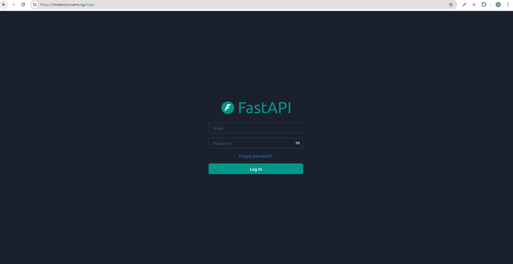

# Frontend - ReactJS with ChakraUI

This directory contains the frontend of the application built with ReactJS and ChakraUI.



## Prerequisites

- Node.js (version 14.x or higher)
- npm (version 6.x or higher)

## Manual Setup Instructions
1. **Clone the Repository and Navigate to the backend directory**:
    ```sh
    git clone <your-repository-url>
    cd <repository-directory>/frontend
    ```

2. **Install dependencies**:
```sh
npm install
```

3. **Run the development server**:
    ```sh
    npm run dev
    ```

4. **Configure API URL**:
Ensure the API URL is correctly set in the `.env` file. The API URL is the address of the API server (backend)

### Running the Frontend Application with Docker
1. Create a new Dockerfile inside the `frontend` directory
2. Add the following content to the Dockerfile:
```dockerfile
# Use the official Node.js 20 image as the base image
FROM node:20-alpine3.19 AS build

# Set the working directory inside the container
WORKDIR /app

# Copy package.json and package-lock.json to the working directory
COPY package*.json ./

# Install dependencies
RUN npm install

# Copy the rest of the application code to the working directory
COPY . .

# Expose the port the app runs on
EXPOSE 5173

# Start the application
CMD ["npm", "run", "dev"]
```
This Dockerfile sets up the Node.js environment, installs the necessary dependencies, and runs the development server using `npm run dev`.

2. Build the Docker Image
Navigate to the directory containing the Dockerfile and run the following command to build the Docker image:
```sh
docker build -t frontend-app .
```

3. Run the Docker Container
Run the Docker container, mapping port 80 of your host machine to port 5173 of the container:
```sh
docker run -d -p 5173:5173 --name frontend-app frontend-app
```

4. Verify the Frontend Application
Open your browser and navigate to  `http://<your-ip-address>:5173` to access the running frontend application.